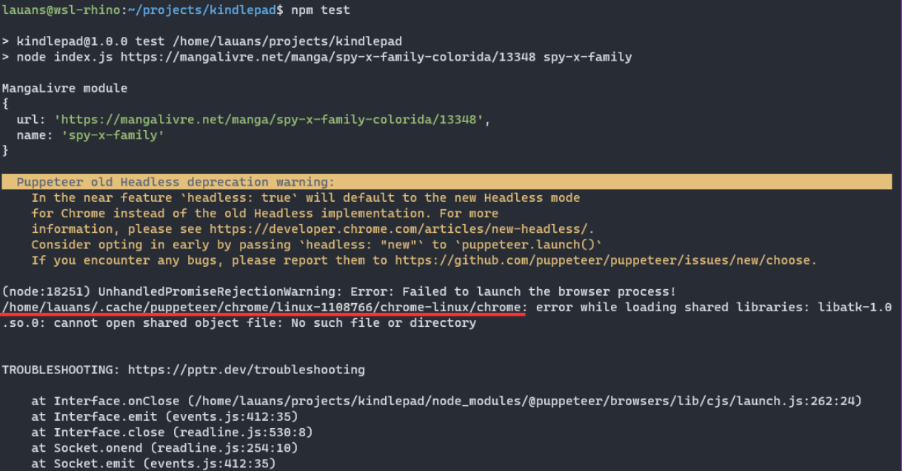

# Kindlepad

## Conceito do projeto

Este projeto tem como objetivo permitir que os leitores acessem e leiam artigos, livros, mangás, entre outros, de forma offline, a partir da extração dessas histórias de diferentes origens.

Para isso ele foi projetado para funcionar com módulos, onde cada módulo terá as funcionalidades necessárias para extração do conteúdo.

Nesse repositório se encontra disponível para demonstração o módulo do MangaLivre.net, uma plataforma online que oferece mangás com anúncios aos leitores. A proposta é extrair as imagens dos mangás, baixá-las e reuni-las em um único arquivo, facilitando a leitura em aplicativos dedicados à leitura de quadrinhos mesmo sem conexão com a internet.

### Funcionamento:

O projeto consiste em um sistema que realiza as seguintes etapas:

* Acesso ao mangalivre.net: O sistema acessa o site MangaLivre.net para obter os mangás disponíveis para leitura online.

* Extração de imagens: A partir dos mangás selecionados, o sistema extrai as imagens dos capítulos, garantindo que todo o conteúdo visual seja capturado com fidelidade.

* Download das imagens: Após a extração, as imagens são baixadas para o computador do usuário, tornando-as acessíveis mesmo em ambientes sem conexão à internet.

* Geração de arquivos próprios para leitura: Todas as imagens baixadas são agrupadas em arquivos CBR (Comic Book Reader), separados por capítulo e seguindo a ordem original do mangá. Dessa forma, o usuário pode ler o mangá de forma contínua, sem interrupções.

### Benefícios:

Este projeto traz diversos benefícios para leitores que precisam acessar um conteúdo de forma offline, em especial os entusiastas de mangás, graças ao módulo disponibilizado, como:

* Leitura offline: Permite a leitura mesmo em locais sem acesso à internet, tornando-se uma solução ideal para viagens ou locais remotos.

* Organização: As informações extraídas são agrupadas em um único arquivo, facilitando a organização e evitando a necessidade de ter que carregar partes de um capitulo dinamicamente.

* Acessibilidade: Usuários que não possuem conexão à internet podem desfrutar de seus mangás favoritos sem restrições.

* Economia de dados: Uma vez que o mangá é baixado, não é mais necessário utilizar dados móveis ou conexão Wi-Fi para a leitura.

* Melhor experiência: O conteúdo gerado vem livre de anúncios e interrupções, além de possibilitar o compartilhamento e-readers.

### Conclusão:

Em suma, esse projeto é uma solução prática e útil para leitores que buscam maior flexibilidade e comodidade em sua experiência de leitura.
  
## Pré-requisitos e recursos utilizados

Para o desenvolvimento do projeto foi utilizado Node.js com as seguintes bibliotecas:

* puppeeteer: Utilizado para conectar com um browser chromium e simular a interação do usuário com o browser.

* axios: Utilizado para o  fazer requisições http.

* archiver: Utilizado para agrupar os arquivos obtidos e gerar um único arquivo cbr.

Além disso, foi utilizadas as bibliotecas e funções disponibilizadas pelo node para manipulação de arquivos e buscas por padrões com expressões regulares.

  
## Passo a passo

Para a implementação do projeto, primeiro é necessário entender o funcionamento do site mangalivre.net:

É possível resumir as tarefas necessárias para ler um mangá em alguns passos: Acessar a plataforma e escolher um título; Selecionar o mangá e ser direcionado a página com a lista dos capítulos; Escolher algum capítulo para leitura; Navegar entre as páginas do capítulo até o final, onde há um link para o próximo.

Assim para o desenvolvimento do código podemos abstrair alguns passos como:

* Fazer a requisição HTTP para o site

* Extrair do html do site os links para cada capítulo

* Extrair do html do site as imagens do mangá

* Extrair do html do site o link para a próxima página do capítulo

* Dentro de cada capítulo de mangá, a diferenciação da uma página para outra se dá pelo link, como por exemplo:

  https://mangalivre.net/ler/one-piece/online/483101/1089#/!page1

  https://mangalivre.net/ler/one-piece/online/483101/1089#/!page2

No exemplo acima podemos diferenciar uma página da outra apenas pelo sufixo do link, então para acessarmos todas as páginas do capítulo, bastaria iterarmos sobre esse sufixo.

* Já a diferenciação de capítulos, não se dá da mesma forma:

  https://mangalivre.net/ler/one-piece/online/479971/1088#/!page0

  https://mangalivre.net/ler/one-piece/online/483101/1089#/!page0

No exemplo acima temos os links para os capítulos 1088 e 1089 do mangá One Piece, e como pode ser observado, não há um padrão para o link, de forma que para acessarmos todos os capítulos uma simples iteração sobre o link não seria possível

Devido a tal problema, para acessarmos o link de cada capítulo, teríamos que acessar o link da página do mangá e então acessar os links para cada capítulo que se encontra então no html.

Finalizando, após a extração das imagens, foi necessário apenas colocar todas as páginas dentro de um diretório de forma ordenada e compactar a pasta.

Dessa forma foram implementado o arquivo index.js na pasta `src/modules/mangalivre`, para fazer a extração das imagens do site e o arquivo index.js da pasta `src/utils` para fazer a compactação do arquivo.


## Instalação

Para rodar o projeto, é necessário:

- Instalar o [Node.js](https://nodejs.org/en/download) (versão v14 ou superior) e o npm/yarn
  - O npm vem instalado por padrão junto com o Node.js
- Realizar o clone do repositório
- Instalar as dependências do projeto
  ```
  npm i
  ```

Com isso o projeto estará instalado e pronto para ser executado.

## Execução

Para rodar o projeto, baixando um título de demonstração, basta executar o comando:

```
npm run test
```


Esse comando irá executar o módulo do Mangalivre.net para baixar um manga.

Ele ficará disponível em `generated/mangalivre/spy-family`


Para baixar outro título, é necessário rodar rodar o comando abaixo atualizando os valores:

```
node index.js <URL_DO_MANGA> <NOME_DO_ARQUIVO_DE_SAIDA>
// Exemplo:
// node index.js https://mangalivre.net/manga/spy-x-family-colorida/13348 spy-x-family
```

## Possíveis complicações no Linux

### [Bibliotecas para executar o chromium não encontradas](https://github.com/puppeteer/puppeteer/blob/main/docs/troubleshooting.md#chrome-doesnt-launch-on-linux)

O módulo disponível nesse projeto (Mangalivre.net) utiliza a biblioteca puppeteer para instanciar um browser (Chromium) e assim conseguir baixar o manga.

Para o browser ser executado corretamente, ele depende de algumas bibliotecas no seu sistema.

Se ao tentar executar o projeto você se deparar com um erro semelhante ao exemplificado na imagem, será preciso realizar a instalação dessas bibliotecas.



As bibliotecas necessárias podem ser consultadas ao executar o seguinte comando na pasta de instalação do navegador (por padrão é instalado em uma pasta em `~/.cache/puppeteer/*`, destacamos em vermelho na imagem acima o local onde aparece o caminho completo)

```
ldd chrome | grep not
```


Para instalar esses pacotes, execute
```
sudo apt update -y
sudo apt install ${BIBLIOTECAS_QUE_ESTÃO_FALTANDO} -y
```

Uma [lista completa das dependências](https://github.com/puppeteer/puppeteer/blob/main/docs/troubleshooting.md#chrome-doesnt-launch-on-linux) também podem ser consultado na documentação do puppeteer


## Bugs/problemas conhecidos

O projeto possui uma limitação de que alguns mangás do site, não possuem mesma padronização de nome, e portanto, o regex implementado para obter as imagens e links do sites, pode não funcionar para determinado título, além disso, caso haja alguma atualização no site mangalivre, é possível que o projeto para de funcionar pois não está configurado para essa novas configurações do site.

## Autores

Lauan dos Santos Souza ([lauanS](https://github.com/lauanS))

Maria Anita de Moura ([A-nita](https://github.com/A-nita))

## Imagens/screenshots

Leitura de um mangá pelo leitor Cover

